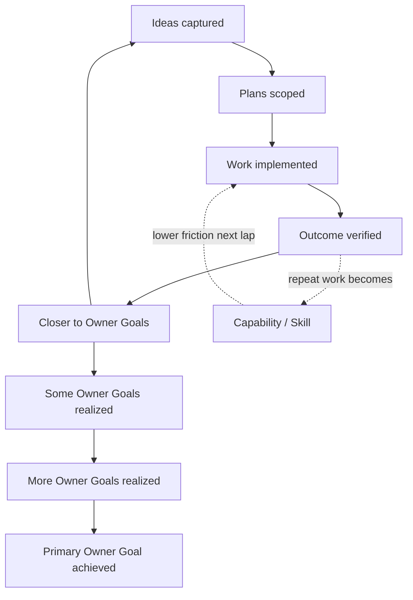

<!--
IndexTitle: Owner Goal Operating Loop
IndexDescription: User-facing diagram and walkthrough for how Ideas, Plans, work, and outcomes compound toward Owner Goals with lower friction each lap.
IndexType: Setup
IndexStatus: Active
LastEdited: 2026-06-08
-->

# Owner Goal Operating Loop

This page explains how **Owner Goals** are achieved through repeated cycles—not
one big push. It complements `Workspace/OwnerGoals.md` and
`Plans/RepositoryGoals.md`.

## The Loop

Each lap moves you closer to your goals. Repeat work becomes **Capabilities**
(and optional **Skills**), so the next lap costs less friction.

## Plain Language

1. **Ideas captured** — possibilities land in `Ideas/` or `Plans/Ideas.md`, not
   chat alone.
2. **Plans scoped** — selected Ideas become scoped Plans in `Plans/`.
3. **Work implemented** — agents route through **Capabilities**; files change in
   the right folders.
4. **Outcome verified** — progress counts only when **disk matches the claim**
   (not backlog-only “Done”).
5. **Closer to Owner Goals** — update `Workspace/OwnerGoals.md` statuses and
   notes.
6. **New Ideas and Plans** — outcomes inform the next lap.
7. **Some / more Owner Goals realized** — statuses move toward **Achieved**.
8. **Primary Owner Goal achieved** — the end product or main outcome you named
   in Quick Startup.

## What Counts As Progress

| Stage | Signal |
| --- | --- |
| Ideas | Row in register; source captured |
| Plans | Scoped plan file exists; linked to an Owner Goal |
| Work | Capability-routed pass; reviewable diff |
| Outcome | Files on disk match the handoff; owner can verify |
| Realized | Owner Goal status → **Achieved** |

## Lower Friction Each Lap

When the same workflow repeats, promote it into a **Capability** so the next
agent routes to `Capabilities/<Name>/Rules.md` and `Prompt.md` instead of
reinventing steps. Optional **Skills** handle deterministic sub-steps.

Harmonize passes ([CapabilityHarmonize](../CapabilityHarmonize/README.md))
adopt improvements from peer repositories without duplicating instruction
surfaces.

## Cloud And Local

The repository should work **locally** (for example Cursor with the repo open)
and **in the cloud** (for example ChatGPT with an on-demand Drive or Dropbox
review copy). Runtime rules live in
[Standards/AgentSituationalAwareness.md](../../Standards/AgentSituationalAwareness.md)
and [SituationalAwareness](../SituationalAwareness/README.md).

GitHub maintenance and beginner setup route through
[GitHubWorkflow](../GitHubWorkflow/README.md).

## End Product Connection

The **Primary Owner Goal** for this repository is to ship GetEstablished as a
**downloadable or git-cloneable workspace**—packaged via
[StarterRepositoryPackage](../StarterRepositoryPackage/README.md) when ready.
The operating loop is how the method host proves that product works before and
after packaging.

## Related

- [Workspace/OwnerGoals.md](../../Workspace/OwnerGoals.md)
- [GettingStarted.md](GettingStarted.md)
- [Plans/GoalsIdeasPlansCapabilitiesModel.md](../../Plans/GoalsIdeasPlansCapabilitiesModel.md)
- [Plans/RepositoryGoals.md](../../Plans/RepositoryGoals.md)
