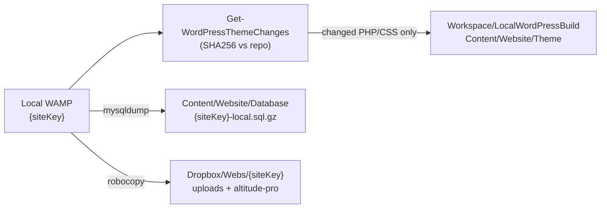

<!--
IndexTitle: WordPress Save Workflow
IndexDescription: Owner-approved workflow to save local WAMP WordPress database and theme sources to Git and large assets to Dropbox.
IndexType: Project
IndexStatus: Active
LastEdited: 2026-07-02
-->

# WordPress Save Workflow

After local WordPress edits (Customizer, wp-admin, theme CSS/PHP, widgets, menus,
content), run **WordPress Save** to persist work in two places:

| Destination | What | Why |
| --- | --- | --- |
| **Git repository** | Database snapshot + changed theme PHP/CSS text files | Version history, cross-PC handoff, agent-readable source |
| **Dropbox** | `uploads` + theme `images` (+ full `altitude-pro` for restore) | Large binaries stay out of Git |

This is the **inverse** of the build/restore direction documented in
[{siteKey}LocalWordPressBuildPlan.md]({siteKey}LocalWordPressBuildPlan.md) and
[LocalWordPressSetupPlan.md](LocalWordPressSetupPlan.md).

## One Command

From the repository root:

```powershell
.\Automation\WordPressSave\Save-LocalWordPress.ps1
```

Preview only:

```powershell
.\Automation\WordPressSave\Save-LocalWordPress.ps1 -WhatIf
```

Partial passes:

```powershell
.\Automation\WordPressSave\Get-WordPressThemeChanges.ps1
.\Automation\WordPressSave\Save-LocalWordPress.ps1 -ThemeOnly
.\Automation\WordPressSave\Save-LocalWordPress.ps1 -DatabaseOnly
.\Automation\WordPressSave\Save-LocalWordPress.ps1 -DropboxOnly
```

## Workflow Steps



### Step 1 — Theme text files → Git (changed only)

The manifest
[`Automation/WordPressSave/ThemeTrackManifest.json`](../Automation/WordPressSave/ThemeTrackManifest.json)
defines which WAMP theme files are eligible for Git save and their repo targets.

**Rule:** only files that **differ from the repository copy** (SHA256 hash) are
copied. Unchanged stock Altitude files are never saved.

#### Required Git-tracked theme files ({siteKey})

| Category | WAMP path (under `altitude-pro/`) | Repository path | Role |
| --- | --- | --- | --- |
| CSS | `geotw-custom/geotw-altitude-custom.css` | `Workspace/LocalWordPressBuild/mc-altitude-custom.css` | Primary custom overlay CSS |
| PHP | `geotw-custom/mc-customizations.php` | `Workspace/LocalWordPressBuild/mc-customizations.php` | Inventory/theme hooks |
| PHP | `geotw-custom/geotw-customizations.php` | `Content/Website/Theme/altitude-pro/geotw-custom/geotw-customizations.php` | CSS enqueue loader |
| PHP | `geotw-custom/geotw-site-links.php` | `Content/Website/Theme/altitude-pro/geotw-custom/geotw-site-links.php` | Link helpers |
| PHP | `functions.php` | `Content/Website/Theme/altitude-pro/functions.php` | Child theme functions (mc require) |
| CSS | `style.css` | `Content/Website/Theme/altitude-pro/style.css` | Child theme stylesheet |

#### Optional Git-tracked templates (save when modified)

Use `-IncludeOptionalThemeFiles` on the save script, or `-IncludeOptional` on the
change scan:

| WAMP path | Repository path |
| --- | --- |
| `page_blog.php` | `Content/Website/Theme/altitude-pro/page_blog.php` |
| `page_archive.php` | `Content/Website/Theme/altitude-pro/page_archive.php` |
| `page_landing.php` | `Content/Website/Theme/altitude-pro/page_landing.php` |
| `front-page.php` | `Content/Website/Theme/altitude-pro/front-page.php` |

#### Out of scope for Git save

- WordPress core, plugins, Genesis parent theme
- `wp-config.php`, `mu-plugins`, full `uploads/`
- Theme binary assets (`images/*.png`, `*.ico`, `*.webp`, etc.)
- Stock Altitude `lib/`, `config/`, `js/` unless explicitly added to manifest later

### Step 2 — Database → Git

Runs [`Export-LocalWordPressDatabase.ps1`](../Automation/DatabaseBackups/Export-LocalWordPressDatabase.ps1).

| Output | Path |
| --- | --- |
| Compressed snapshot | `Content/Website/Database/{siteKey}-local.sql.gz` |

Captures pages, posts, options, menus, widgets, and local user records. See
[`Content/Website/Database/README.md`](../Content/Website/Database/README.md).

### Step 3 — Large assets → Dropbox

Runs [`Mirror-WebAssetsToDropbox.ps1`](../Automation/MirrorWebAssets/Mirror-WebAssetsToDropbox.ps1)
(`-SiteKey {siteKey}`).

| WAMP source | Dropbox target |
| --- | --- |
| `%WAMP_WWW_ROOT%\{siteKey}\wp-content\uploads` | `C:\Users\dwlot\Dropbox\Webs\{siteKey}\uploads` |
| `%WAMP_WWW_ROOT%\{siteKey}\wp-content\themes\altitude-pro\images` | `C:\Users\dwlot\Dropbox\Webs\{siteKey}\altitude-pro\images` |
| Full child theme (restore bundle) | `C:\Users\dwlot\Dropbox\Webs\{siteKey}\altitude-pro` |

The full `altitude-pro` mirror includes `geotw-custom/`, `images/`, and templates
for one-step restore via
[`Restore-WebAssetsFromDropbox.ps1`](../Automation/MirrorWebAssets/Restore-WebAssetsFromDropbox.ps1).

#### Current theme images (Dropbox, not Git)

Observed on this PC (2026-07-02):

| File | Approx. size | Role |
| --- | --- | --- |
| `images/favicon.ico` | 29 KB | Favicon |
| `images/{siteKey}-site-icon-512.png` | 29 KB | Site icon |
| `images/truck-capacity-chart.png` | 47 KB | Front-page chart asset |

Media library files under `uploads/` (~2,400 files, ~97 MB on this PC) also mirror
to Dropbox only.

## Restore Handoff (inverse workflow)

| Need | Command |
| --- | --- |
| Database from Git | Import `Content/Website/Database/{siteKey}-local.sql.gz` — see Database README |
| Theme/uploads from Dropbox | `Restore-WebAssetsFromDropbox.ps1 -SiteKey {siteKey}` |
| Markdown → WordPress (build) | `Workspace/LocalWordPressBuild/mc-sync-all.php --write` (owner-approved) |

Typical new-PC sequence:

1. Pull Git repository
2. Restore database snapshot
3. Restore Dropbox web assets
4. Confirm `http://localhost/{siteKey}/`

## Prerequisites

1. User env var **`WAMP_WWW_ROOT`** points at the WAMP `www` folder on this PC.
2. WAMP MySQL is running (for database export).
3. Dropbox Desktop is running and `Dropbox\Webs\{siteKey}` exists (for asset mirror).
4. Owner explicitly requested the save pass (on-demand — not automatic).

## Agent Report Block

```text
WordPress Save:
- Theme files changed: <count> (list paths)
- Database snapshot: Content/Website/Database/{siteKey}-local.sql.gz (<bytes>)
- Dropbox mirror: uploads + altitude-pro — success | skipped | failed
- Git commit: not performed (owner must request)
```

## Related

- [InventoryImagePipeline.md](InventoryImagePipeline.md) — refresh item images before WordPress Save
- [Content/Website/Theme/README.md](../Content/Website/Theme/README.md)
- [MirrorWebAssetsWorkflow.md](../Capabilities/MirrorWebAssets/MirrorWebAssetsWorkflow.md)
- [OwnerPreferences.md](../Workspace/OwnerPreferences.md) § Web asset mirror
- [{siteKey}LocalWordPressBuildPlan.md]({siteKey}LocalWordPressBuildPlan.md)
